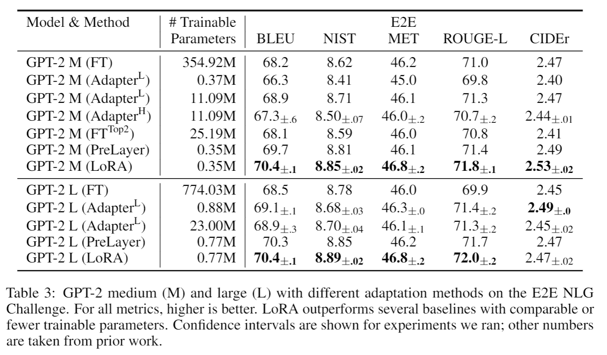
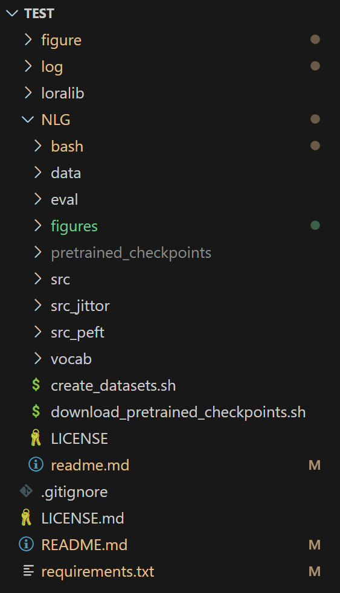

# NLG: Adapting GPT-2 using LoRA

> Origin Repo: https://github.com/microsoft/LoRA/tree/main/examples/NLG`<br>`

ATTENTION: 便于对照论文声明的实验性能，本实验使用 [GPT2-Medium](https://huggingface.co/openai-community/gpt2-medium) 版本。

<p>

</p>

本文件夹详细介绍：

1. LoRA 原代码环境配置与实现性能复现
1. Jittor 重构代码与性能对齐
1. PEFT 搭建的快捷实验流程

## Repository Overview

主要文件目录：

<p>

</p>

NOTE: 存放大参数权重文件的 folder 在上传仓库时被 .gitignore 注释掉，所以可能拉取代码时未出现。还是以运行代码后本地目录的情况为准。

* Command
  * **[bash/](bash) 复现指令，按照数据集和复现方法分类。**

* Source Code
  * [src/](src) 来自官方仓库的 LoRA 原实现代码，基于 torch 实现，没有使用更高级的封装（相比 NLU，使用 transformer 实现）
  * [src_jittor/](src_jittor) 保持原本的代码结构，使用 Jittor 框架整体重构 torch 代码
  * [src_peft/](src_peft) 使用现代 LoRA 框架 PEFT 搭建的训练、推理、评估实验流程
  * [eval/](eval) 手动下载的模型生成评价函数
* Source
  * [data/](data) 实验涉及的全部数据 train, test, valid 以及复现过程中缩放后的数据，以下划线+数量代表缩放后的全部数量
  * [vocab/](vocab) 对应 GPT-2 的词表。当前主流下载模型会同时下载好词表，但是官方代码只对.bin训练，需要专门放置好词表
* Model Checkpoints
  * [pretrained_checkponits/](pretrained_checkponits)
  * [trained_models/](trained_models) 官方实现训练模型权重存放文件
  * [trained_models_jittor/](trained_models_jittor) Jittor 实现训练模型权重存放文件
  * [trained_models_peft/](trained_models_jittor) PEFT 实现训练模型权重存放文件

## Getting Started

1. Clone repo, install dependencies in a virtual environment

```

 sudo apt-get update
 ···
 (activate your virtual environment)
 ···
 bash download_pretrained_checkpoints.sh
 bash create_datasets.sh
 cd ./eval
 bash download_evalscript.sh
 cd ..
```
## Replication

本仓库的复现:
- 采用三种方法：torch, jittor, peft，
- 分别在三个数据集进行实验：e2e, webnlg, dart

### Strategy 1: Pipeline

可通过下面的指令，**自动化运行全部流程**：
```
# dataset = 'e2e'/ 'webnlg'/ 'dart'
# method = 'torch' / 'jittor'/ 'peft'  
cd NLG
bash bash/{dataset}/data/sh # 数据处理
bash bash/{dataset}/{method}.sh # 训练、推理、解码、评估，集成指令
```

### Strategy 2: Seperate Step
或者，打开目标 .sh 文件，分步骤手动执行。

以 dataset = 'dart', method = 'jittor' 为例：

1. open `bash/dart/peft.sh`
2. Train
   ```
    # train
    time python src_jittor/gpt2_ft.py \
        --train_data ./data/dart/train_5k.jsonl \
        --valid_data ./data/dart/valid_600.jsonl \
        --train_batch_size 4 \
        --grad_acc 1 \
        --valid_batch_size 2 \
        --seq_len 512 \
        --model_card gpt2.md \
        --init_checkpoint ./pretrained_checkpoints/gpt2-medium-pytorch_model_zip.bin \
        --platform local \
        --clip 0.0 \
        --lr 0.0002 \
        --weight_decay 0.01 \
        --correct_bias \
        --adam_beta2 0.999 \
        --scheduler linear \
        --warmup_step 500 \
        --max_epoch 5 \
        --save_interval 1000 \
        --eval_interval 1000 \
        --lora_dim 4 \
        --lora_alpha 32 \
        --lora_dropout 0.1 \
        --label_smooth 0.1 \
        --work_dir ./trained_models_jittor/GPT2_M/dart \
        --random_seed 110
   ```
3. Inference
    ```
    # inference
    time python src_jittor/gpt2_beam.py \
        --data ./data/dart/test_1k.jsonl \
        --batch_size 1 \
        --seq_len 512 \
        --eval_len 64 \
        --model_card gpt2.md \
        --init_checkpoint ./trained_models_jittor/GPT2_M/dart/model.6250.pt \
        --platform local \
        --lora_dim 4 \
        --lora_alpha 32 \
        --beam 10 \
        --length_penalty 0.8 \
        --no_repeat_ngram_size 4 \
        --repetition_penalty 1.0 \
        --eos_token_id 628 \
        --work_dir ./trained_models_jittor/GPT2_M/dart \
        --output_file predict.6250.b10p08r4.jsonl
    ```
4. Decode
    ```
    # decode
    python src_jittor/gpt2_decode.py \
            --vocab ./vocab \
            --sample_file ./trained_models_jittor/GPT2_M/dart/predict.6250.b10p08r4.jsonl \
            --input_file ./data/dart/test_formatted_1k.jsonl \
            --ref_type dart \
            --ref_num 6 \
            --output_ref_file eval/GenerationEval/data/references_dart \
            --output_pred_file eval/GenerationEval/data/hypothesis_dart \
            --tokenize --lower
    ```
5. Evaluate
    ```
    # evaluate
    cd ./eval/GenerationEval/
    python eval.py \
        -R data/references_dart/reference \
        -H data/hypothesis_dart \
        -nr 6 \
        -m bleu,meteor,ter 
    cd ../..
    ```
