# LoRA Replication & Jittor Refactor

> **LoRA: Low-Rank Adaptation of Large Language Models** <br>
> *Edward J. Hu\*, Yelong Shen\*, Phillip Wallis, Zeyuan Allen-Zhu, Yuanzhi Li, Shean Wang, Lu Wang, Weizhu Chen* <br>
> Paper: https://arxiv.org/abs/2106.09685 <br>
> Github: https://github.com/microsoft/LoRA <br>

LoRA 通过秩（rank）分解矩阵来减少可训练参数的数量，同时冻结原始权重。

* 极大地降低了针对特定任务适配的大语言模型的存储需求
* 并能够在部署期间实现高效的任务切换
* 且不会引入推理延迟

<p>
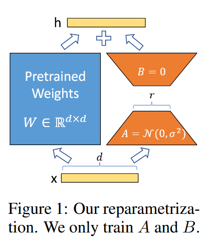
</p>

|  | Method              | # of Trainable Params | E2E (BLEU) | DART (BLEU) | WebNLG (BLEU-U/S/A)             |
| - | ------------------- | --------------------- | ---------- | ----------- | ------------------------------- |
|  | GPT-2 M (Fine-Tune) | 354.92M               | 68.2       | 46.0        | 30.4/63.2/47.6                  |
|  | GPT-2 M (LoRA)      | 0.35M                 | 70.4 ±.1  | 47.1 ±.2   | 46.7 ±.4/ 62.1 ±.2/ 55.3 ±.2 |

## 复现任务要求

如果计算资源有限，用少量数据的训练效果和pytorch版本的结果对齐。

将训练过程log，loss曲线，结果等对齐情况进行记录，将下述内容都放在README中。

* [X] [环境配置](#environment)
* [X] [数据准备脚本](#data-prepare)
* [X] [训练脚本](#seperate-steps)
* [X] [测试脚本](#seperate-steps)
* [X] [Jittor-torch对齐Log](#log)
* [X] [性能Log](#log)

## Content

| Section                                 | Description     |
| --------------------------------------- | --------------- |
| [Overview](#overview)                      |                 |
| [Jittor Refactor](#jittor-refactor)        | Jittor 重构思路 |
| [Experiment](#experiment)                  | 实验设计、运行  |
| [Log &amp; Performance](#log--performance) | 日志、运行结果  |
| [Other Performance](#other-performance)    | 补充性能对比    |
| [Debug](#debug)                            | 调试信息        |
| [Reference](#reference)                    |                 |
| [Citation](#citation)                      |                 |

## Overview

复现的思路分为以下三个步骤：

1. 复现并基本调试原仓库的 LoRA 实现代码，验证声明的实验性能与整体。
2. Jittor 重构原 torch 框架的代码，在三个数据集上对齐实验性能。
3. (Addition) 使用原论文推荐的现代框架 [PEFT](https://huggingface.co/docs/peft/en/index) 复现 LoRA 实验。

### Innovation

* 使用当前（截止2025年7月）较新的环境配置复现实验。解决兼容遇到的问题，便于后来者在此基础上使用新配置复现。
* 详细记录复现过程观察到的指标。平衡实验效率和配置需求的基础上，对比同期复现工作，对齐原实验的性能差距最小。
* LoRA已被更新的一些高效开发框架兼容。使用官方推荐的 PEFT 搭建整体实验流程。

本仓库的复现，平衡实现效率和配置需求，对比上述的同期复现工作，对齐原实验的性能差距最小。本仓库是从[1]官方仓库的 torch 版本出发，自主重构成 Jittor。

下图展示的是一部分实验结果，官方实现、torch复现、PEFT复现的整体实验性能对比：

<p align="center">
   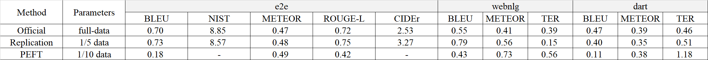
</p>

将上述表格信息绘制成图表，更直观展示对比。

<p align="center">
  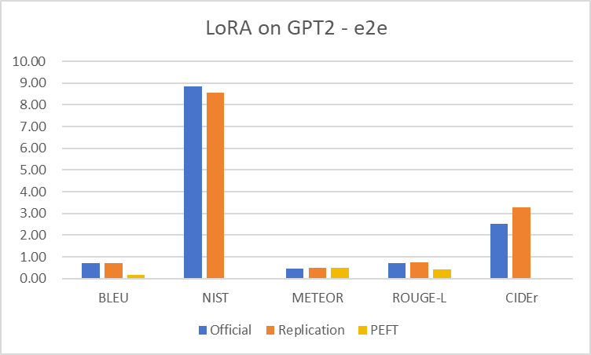
  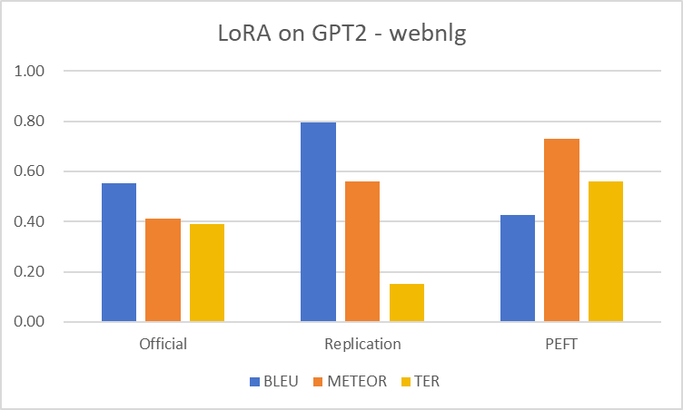
  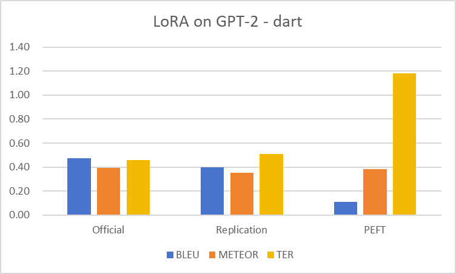
</p>

## Jittor Refactor

主要参考：

- [6]Jittor官方的API文档，寻找Jittor中对应torch的函数。
- [7][8]两篇使用Jittor重构torch的经验分享博客
- 部分处理对照[3][4][5]的解决方法

### Pipeline

1. torch 直接替换成 Jittor
   ```
   # import torch
   # import torch.nn as nn
   import Jittor as Jt
   from Jittor import nn
   ```
2. tensor(torch) 替换成 Var(Jittor)
3. 模型结构中的forward(torch) 替换成 exexcute(Jittor)
4. 冻结参数，不计算梯度：**requires_grad=False** 替换成 **stop_grad()**
5. Other: 具体的函数接口替换，检索[6]官方的API文档。包括但不限于：
   * dataset, dataloader
   * 矩阵初始化
   * dtype
   * ...

## Experiment

### Environment

AutoDL 租用云服务器（推荐内蒙B区，3090资源充足）

* PyTorch 2.3.0 + Python 3.12(ubuntu22.04) + CUDA 12.1
* GPU RTX 3090(24GB) * 1
* CPU 14 vCPU Intel(R) Xeon(R) Gold 6330 CPU @ 2.00GHz
* 内存 60GB
* 硬盘 系统盘: 30 GB 数据盘: 50GB

### Repository Overview

原仓库给出两个实例 NLG, NLU:

* [examples/NLG/](https://github.com/microsoft/LoRA/tree/main/examples/NLG): LoRA in GPT-2
* [examples/NLU/](https://github.com/microsoft/LoRA/tree/main/examples/NLU): LoRA in RoBERTa and DeBERTa

其中，

* NLG 基于 torch 实现整体实验流程，适用于使用 Jittor 框架进行重构与性能对齐。
* NLU 使用高度封装的 transformer 实现实验流程，复现的可能性较低。

因此，本仓库进行 NLG 的复现。

### Config set

1. 对齐论文实验结果：torch 版本，3090的24G显存刚刚好满足
   * 保持原论文参数
   * 缩小数据规模（1/5）
2. Jittor 重构 torch 代码：显存受限，Jittor 版本在训练阶段显存需求高10%左右
   * train/valid batch 缩小为 (1/2)
     * 原 train_batch_size = 8, valid_batch_size = 4
     * Jittor-torch 对齐时 train_batch_size = 4, valid_batch_size = 2
   * 缩小数据规模为（1/10）
3. PEFT: 保持与 2 中一致

### Start up

ATTENTION: Recommend finish [Debug Section](#debug) first

(optional) config acadamic mirror in AutoDL

```
source /etc/network_turbo
```

Clone repository

```
git clone https://github.com/waywooKwong/LoRA-Jittor.git
cd LoRA-Jittor
```

Install dependencies (recommand virtual environment)

```
sudo apt-get update
sudo apt-get install -y default-jre // 安装 Java
···
(activate your virtual environment)
···
pip install -r requirement.txt
```

Enter  `/NLG`  as base folder, run experiment

```
cd NLG
```

ATTENTION: following commands all run in  `./LoRA-Jittor/NLG`

INFO: NLG experiments are implemented on three datasets: e2e, webnlg, dart, and all commands have been formatted in a union form.

**下面以 `e2e` 数据集整体实验流程：训练、推理、解码、评估，作为示例。对齐 torch 和 Jittor 性能。**

ATTENTION: 替换数据集，只需将指令中的 `e2e` 替换为 `webnlg` 、`dart`

### Data prepare

下表格展示，官方代码提供的数据规模。

参考[5]中记录的全参数e2e实验结果，5000 步左右收敛。所以缩放的设计，原trian.jsonl有4w+行，截取8k。

|        | train           | test & test_formatted | valid        |
| ------ | --------------- | --------------------- | ------------ |
| e2e    | 42061 （8000）  | 4693（800）           | 4672（800）  |
| webnlg | 18025（4000）   | 4928（800）           | 2258（400）  |
| dart   | 62659（10,000） | 12552（2000）         | 6980（1200） |

预处理数据，由于资源受限，对比实验中将原有数据规模缩小为 1/10

```bash
bash bash/e2e/data.sh
```

具体的实现方式是直接截取内容片段，展开代码如下（无需重复运行）

```bash
# 缩小为原来的 1/10
head -n 4000 ./data/e2e/train.jsonl > ./data/e2e/train_4k.jsonl
head -n 400 ./data/e2e/valid.jsonl > ./data/e2e/valid_400.jsonl

head -n 400 ./data/e2e/test.jsonl > ./data/e2e/test_400.jsonl
head -n 400 ./data/e2e/test_formatted.jsonl > ./data/e2e/test_formatted_400.jsonl
```

### Run stratege 1: Pipeline

后续有两种指令方式：

1. 直接脚本运行全部指令，实际上是将训练、推理、解码、评估指令集成在 .sh 中

   ```
   bash bash/e2e/jittor.sh
   ```

   如果要执行 torch/PEFT 实验，只需将 `jittor` 更换为 `torch`/`PEFT`。

   ```
   bash bash/e2e/torch.sh
   ```
2. 分步执行，接下来展开每一部分的具体指令（都以 Jittor 代码为例）

### Run stratege 2: Seperate Steps

#### Train

```python
 # train
 time python src_jittor/gpt2_ft.py \
     --train_data ./data/dart/train_5k.jsonl \
     --valid_data ./data/dart/valid_600.jsonl \
     --train_batch_size 4 \
     --grad_acc 1 \
     --valid_batch_size 2 \
     --seq_len 512 \
     --model_card gpt2.md \
     --init_checkpoint ./pretrained_checkpoints/gpt2-medium-pytorch_model_zip.bin \
     --platform local \
     --clip 0.0 \
     --lr 0.0002 \
     --weight_decay 0.01 \
     --correct_bias \
     --adam_beta2 0.999 \
     --scheduler linear \
     --warmup_step 500 \
     --max_epoch 5 \
     --save_interval 1000 \
     --eval_interval 1000 \
     --lora_dim 4 \
     --lora_alpha 32 \
     --lora_dropout 0.1 \
     --label_smooth 0.1 \
     --work_dir ./trained_models_jittor/GPT2_M/dart \
     --random_seed 110
```

#### Inference

```python
 # inference
 time python src_jittor/gpt2_beam.py \
     --data ./data/dart/test_1k.jsonl \
     --batch_size 1 \
     --seq_len 512 \
     --eval_len 64 \
     --model_card gpt2.md \
     --init_checkpoint ./trained_models_jittor/GPT2_M/dart/model.6250.pt \
     --platform local \
     --lora_dim 4 \
     --lora_alpha 32 \
     --beam 10 \
     --length_penalty 0.8 \
     --no_repeat_ngram_size 4 \
     --repetition_penalty 1.0 \
     --eos_token_id 628 \
     --work_dir ./trained_models_jittor/GPT2_M/dart \
     --output_file predict.6250.b10p08r4.jsonl
```

#### Decode

```python
# decode
python src_jittor/gpt2_decode.py \
        --vocab ./vocab \
        --sample_file ./trained_models_jittor/GPT2_M/dart/predict.6250.b10p08r4.jsonl \
        --input_file ./data/dart/test_formatted_1k.jsonl \
        --ref_type dart \
        --ref_num 6 \
        --output_ref_file eval/GenerationEval/data/references_dart \
        --output_pred_file eval/GenerationEval/data/hypothesis_dart \
        --tokenize --lower
```

#### Evaluate

```python
# evaluate
time python eval/e2e/measure_scores.py e2e_ref.txt e2e_pred.txt 
```

ATTENTION: `webnlg` 和 `dart` 使用下述的评估函数。

```python
# evaluate
cd ./eval/GenerationEval/
python eval.py \
    -R data/references_dart/reference \
    -H data/hypothesis_dart \
    -nr 6 \
    -m bleu,meteor,ter 
cd ../..
```

ATTENTION: 原代码的逻辑已经在终端输出记录详细的 Log，注意保存

## Log & Performance

更详细完整的 log 文件记录在 [log/](log) 文件夹中：

* [log/replication-torch](log/replication-torch) 记录复现原论文并验证声明性能
* [log/align-torch-Jittor](log/align-torch-Jittor) 记录对齐 torch 和 Jittor 的实验
* [log/replication](log/replication) 记录使用 PEFT 搭建复现流程的实验

下面主要展示 **Jittor-torch 性能对齐**的 log。

### dataset1: e2e

截取部分训练过程记录的 log 展示如下，完整 log 记录查看 [log/replication-torch/e2e](log/replication-torch)：

```
====================================================================================================
Experiment dir : ./trained_models_jittor/GPT2_M/e2e
loading model pretrained weight.
set max_step: 5000
start to train the model................ 1
/root/LoRA/examples/NLG/src_jittor/gpt2_ft.py:214: DeprecationWarning: Conversion of an array with ndim > 0 to a scalar is deprecated, and will error in future. Ensure you extract a single element from your array before performing this operation. (Deprecated NumPy 1.25.)
  avg_lm_loss.update(float(_lm_loss.data))
| epoch   1 step      100 |    100 batches | lr 4e-05 | ms/batch 544.36 | loss  4.56 | avg loss  5.60 | ppl 270.78
| epoch   1 step      200 |    200 batches | lr 8e-05 | ms/batch 541.69 | loss  3.26 | avg loss  3.80 | ppl 44.50
| epoch   1 step      300 |    300 batches | lr 0.00012 | ms/batch 542.20 | loss  2.94 | avg loss  3.16 | ppl 23.64
| epoch   1 step      400 |    400 batches | lr 0.00016 | ms/batch 542.96 | loss  2.51 | avg loss  2.97 | ppl 19.58
| epoch   1 step      500 |    500 batches | lr 0.0002 | ms/batch 543.07 | loss  3.73 | avg loss  2.93 | ppl 18.68
| epoch   1 step      600 |    600 batches | lr 0.000196 | ms/batch 544.30 | loss  2.74 | avg loss  2.88 | ppl 17.80
| epoch   1 step      700 |    700 batches | lr 0.000191 | ms/batch 542.84 | loss  3.09 | avg loss  2.87 | ppl 17.68
| epoch   1 step      800 |    800 batches | lr 0.000187 | ms/batch 543.30 | loss  2.95 | avg loss  2.84 | ppl 17.18
| epoch   1 step      900 |    900 batches | lr 0.000182 | ms/batch 543.63 | loss  3.29 | avg loss  2.88 | ppl 17.74
| epoch   1 step     1000 |   1000 batches | lr 0.000178 | ms/batch 543.98 | loss  2.82 | avg loss  2.77 | ppl 15.97
saving checkpoint ./trained_models_jittor/GPT2_M/e2e/model.1000.pt
eval samples: 0 loss: jt.Var([1.3142258], dtype=float32)
eval samples: 100 loss: jt.Var([1.2512419], dtype=float32)
average loss 1.4265571147203446
----------------------------------------------------------------------------------------------------
| Eval   1 at step     1000 | time: 25.58s | valid loss  1.43 | valid ppl  4.16 | best ppl  4.16 
----------------------------------------------------------------------------------------------------
saving checkpoint ./trained_models_jittor/GPT2_M/e2e/model.1000.pt
```

#### Alignment

分别展示 torch 和 Jittor 训练过程的 loss, avg_loss, valid_loss。可以观察到 500 步左右，基本收敛，训练loss最终保持在2.6左右。

<p>
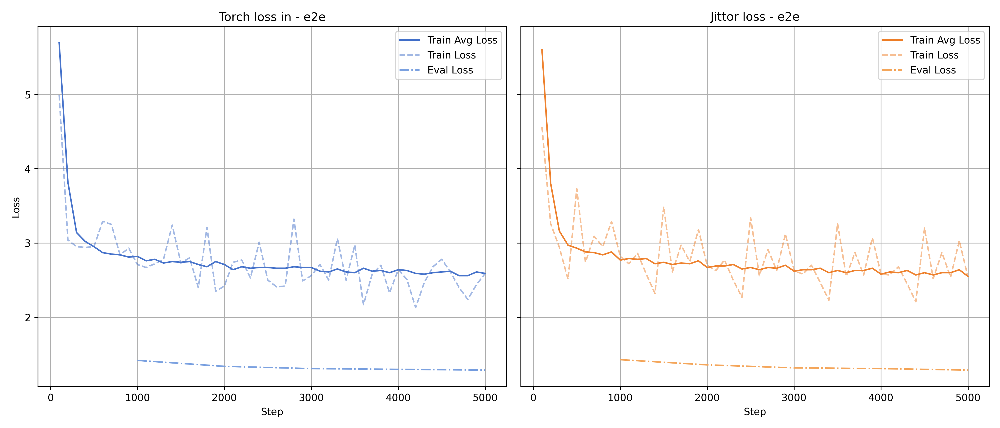
</p>

将 torch, Jittor 的数据绘制在同一张图表，可以观察到avg_loss**基本重合**，说明实现了**性能对齐**，单步的loss出现不同的波动，属于正常现象。

<p>
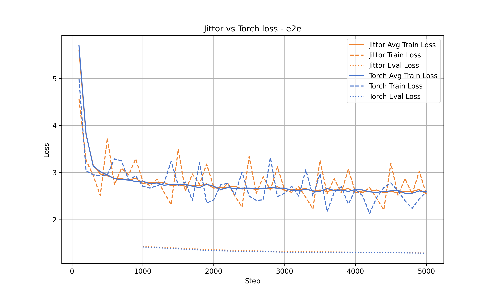
</p>

#### Evaluation

运行评价指标函数，对齐性能，Evaluate 运算过程 log 如下：

```
Running MS-COCO evaluator...
creating index...
index created!
Loading and preparing results...   
DONE (t=0.00s)
creating index...
index created!
tokenization...
PTBTokenizer tokenized 8906 tokens at 88235.44 tokens per second.
PTBTokenizer tokenized 1065 tokens at 16000.19 tokens per second.
setting up scorers...
computing METEOR score...
METEOR: 0.471
computing Rouge score...
ROUGE_L: 0.741
computing CIDEr score...
CIDEr: 3.162
Running Py-MTEval metrics...
SCORES:
==============
BLEU: 0.6942
NIST: 8.0840
METEOR: 0.4708
ROUGE_L: 0.7408
CIDEr: 3.1612
```

注意，每次实验存在一定的误差，图表中最终展示的结果是多次实验取平均的结果。

观察到整体性能保持一致，Jittor的实验性能略好于torch，bias在2%左右。

<p align="center">
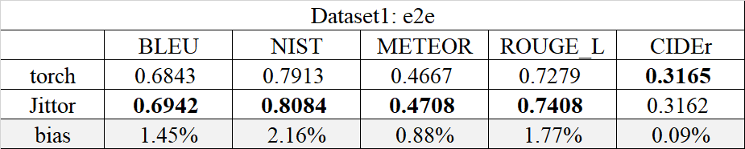
</p>

绘制图表，更直观展示上述表格中的性能对比。

<p align="center">
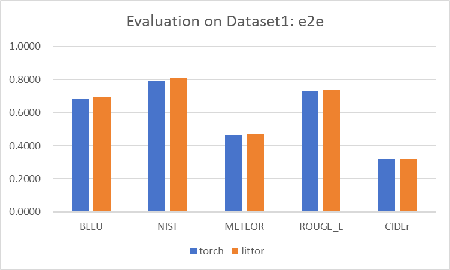
</p>

### dataset2: webnlg

完整 log 记录查看 [log/replication-torch/webnlg](log/replication-torch/webnlg)：

#### Alignment

观察到 500 步左右，基本收敛，训练loss最终保持在2.0左右。

设定的是1000 step进行一次 eval，由于 webnlg 数据集本身数据量比较少，所以很早就结束训练。

<p>
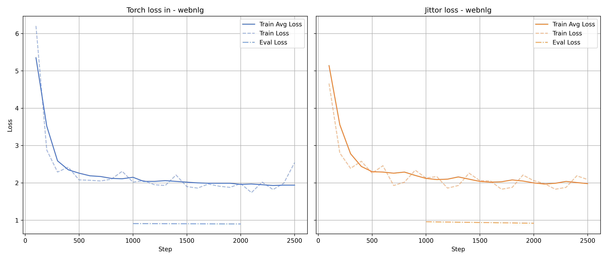
</p>

将 torch, Jittor 的数据绘制在同一张图表，可以观察到avg_loss**基本重合**，说明实现了**性能对齐**，单步的loss出现不同的波动，属于正常现象。

<p>
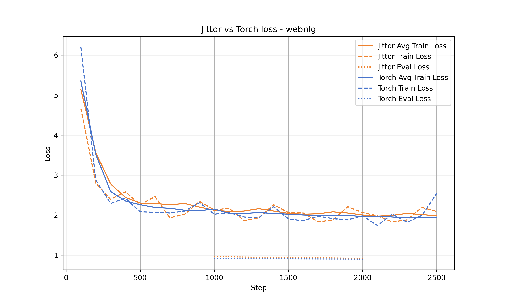
</p>

#### Evaluation

运行评价指标函数，对齐性能。观察到整体性能保持一致，Jittor的实验性能略差于torch，bias在3%左右。

<p align="center">
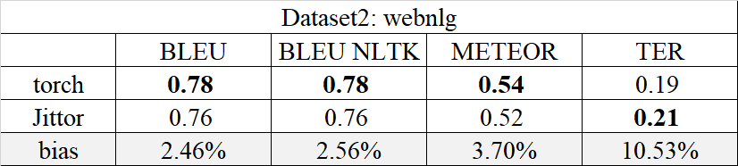
</p>

绘制图表，更直观展示上述表格中的性能对比。

<p align="center">
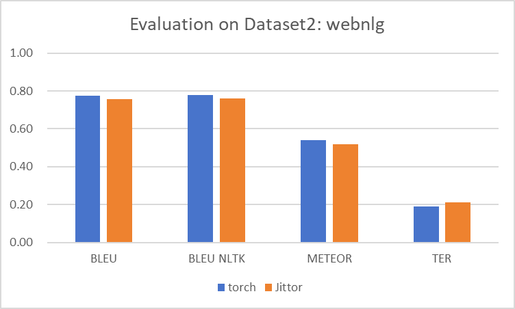
</p>

### dataset3: dart

完整 log 记录查看 [log/replication-torch/dart](log/replication-torch/webnlg)：

#### Alignment

观察到 2000 步左右，基本收敛，训练loss最终保持在2.7左右。

<p>
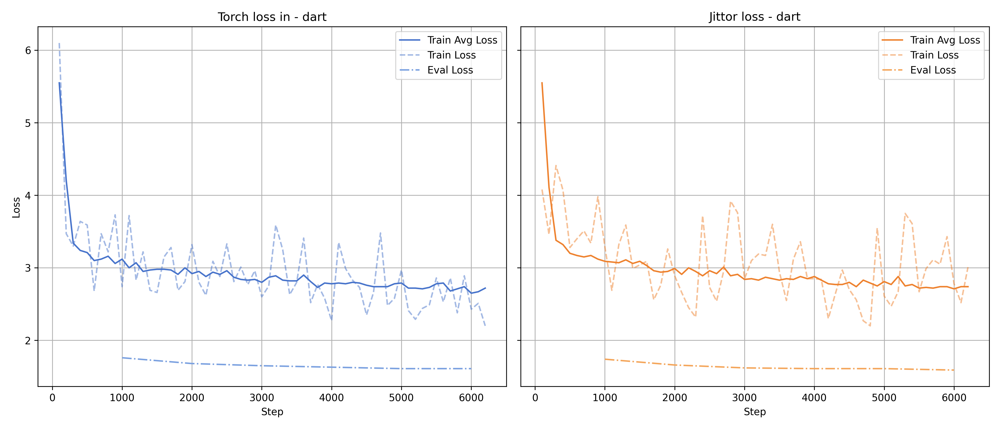
</p>

将 torch, Jittor 的数据绘制在同一张图表，可以观察到avg_loss**基本重合**，说明实现了**性能对齐**，单步的loss出现不同的波动，属于正常现象。

<p>
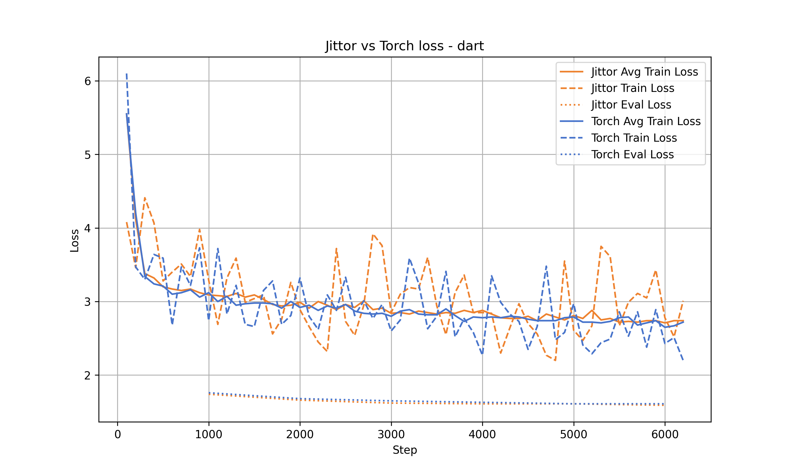
</p>

#### Evaluation

运行评价指标函数，对齐性能。观察到整体性能保持一致，Jittor的实验性能略差于torch，bias在3%左右。

<p align="center">
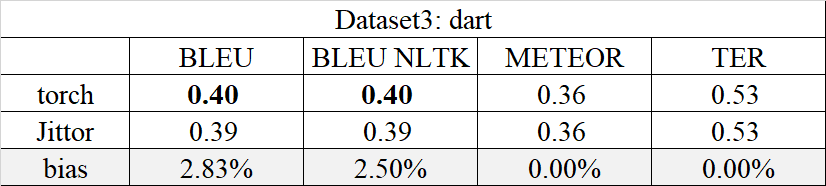
</p>

绘制图表，更直观展示上述表格中的性能对比。

<p align="center">
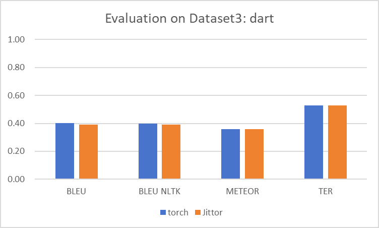
</p>

### Summary

总结整体实验流程的记录，对齐 Jittor 与 torch 性能，保持训练参数完全一致。

综合多次实验取平均，train 过程 loss 下降趋势与随 step 的对应变化基本一致，整体的 evaluation 结果互有高低，bias 不超过5%。

综上，可以认为基本实现了 Jittor-torch 的性能对齐。

#### Alignment

<p align="center">
  
  
  
</p>

#### Evaluation

<p align="center">
  
  
  
</p>

## Other Performance

在主体实验训练、评估过程的记录之外，重点关注GPU显存占用，以及整体运行时间。

### GPU utilization

实验运行环境是单卡 RTX3090 24G，可以缩小数据规模后，按照官方仓库的参数配置复现实验。

`PROBLEM: 但是使用 Jittor 后同样参数运行，出现 OOM 的报错。`

<p>
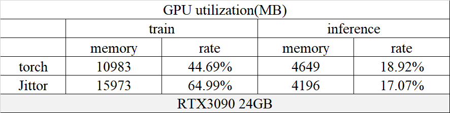
</p>

下面绘制图表，更直观展示上述表格内容。

<p align="center">
  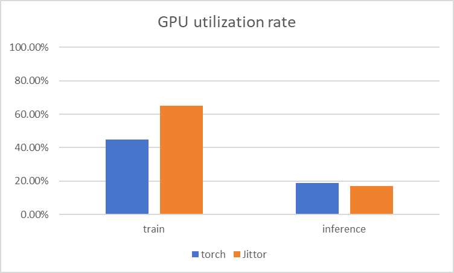
  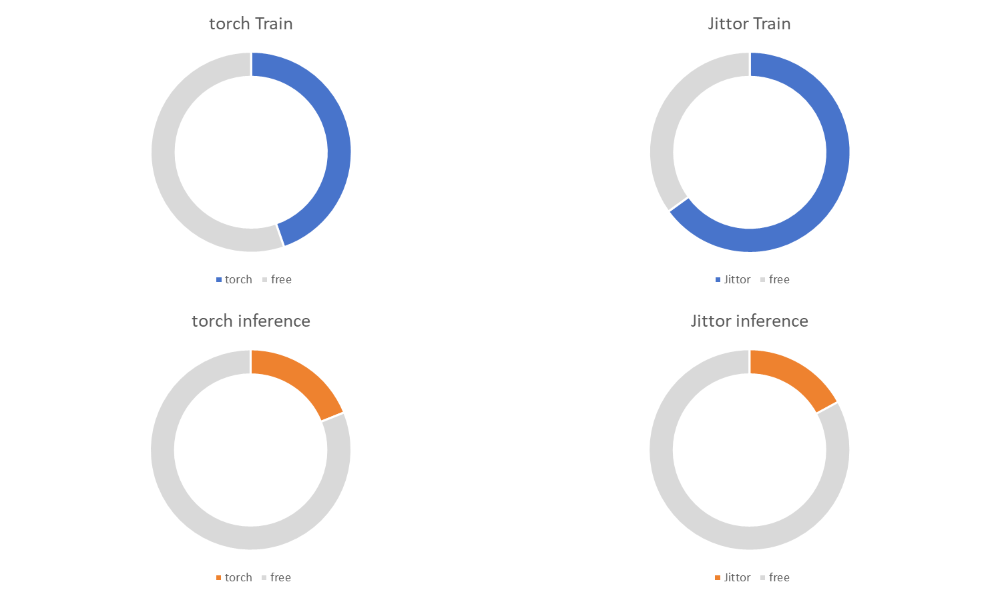
</p>

综合收集的信息，切换不同的任务，不会对显存占用造成影响。整体实验参数的 batch_size 比较关键。

`IMPORTANT: 本仓库的实验观察，训练阶段(train) Jittor 显存占用高于 torch, 推理阶段(inference) Jittor 显存占用要低于 torch`

这就解释了原参数配置为什么 Jittor 会 OOM, torch 的实验已经基本达到 24G 的临界上限。Jittor 占用又高于 torch。

### Runtime

下述表格记录以分钟(min)为单位的训练、推理运行时间，出于简便，略去了秒的单位，但在log中可以找到详细的时间记录。

<p>
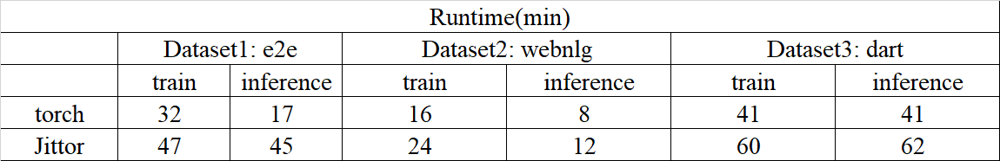
</p>

下面绘制图表，更直观展示上述表格内容。

<p>
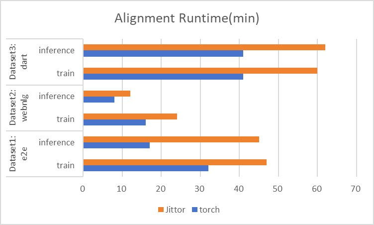
</p>

直观观察到，在本仓库的复现实验的实际表现中，Jittor 的运行效率要低于 torch。

## Debug

### 1. Jittor 安装

```
sudo apt install libomp-dev
python -m pip install git+https://github.com/Jittor/jittor.git
```

运行 Jiitor 测试代码：

```
python -m jittor.test.test_example
```

`Error: ImportError: /root/miniconda3/bin/../lib/libstdc++.so.6: version 'GLIBCXX_3.4.30' not found <br>`
`Debug: Jittor 需要包含 GLIBCXX_3.4.30 符号版本的 C++ 标准库 (libstdc++.so.6)，当前 Conda 环境中提供的版本过旧，不包含这个符号。`

```
conda install -c conda-forge libstdcxx-ng -y
```

正常运行结果：

```
   step 990, loss = 0.0013174716150388122 {'hold_vars': 13, 'lived_vars': 61, 'lived_ops': 55}
   ... ...
   step 999, loss = 0.0009948192164301872 {'hold_vars': 13, 'lived_vars': 61, 'lived_ops': 55}
   ----------------------------------------------------------------------
   Ran 1 test in 14.363s
   OK
```

### 2. Jittor 加载模型权重文件

`ERROR:File "/root/LoRA/examples/NLG/src_jittor/gpt2_ft.py", line 405, in <module>`
`lm_net.load_weight(jt.load(args.init_checkpoint))`

Debug:

1. jt.load 内部调用了 safeunpickle，它尝试用 load_pytorch 加载 PyTorch 的 checkpoint。
2. load_pytorch 把 *.bin 文件当作一个 Zip 文件 来读（底层用 jt.ZipFile），因为 Jittor 的 PyTorch 兼容模块默认认为这是一个 .zip 格式的权重文件（类似 .pt / .pth 有时是 zip 存档）。

```
import torch
from transformers import GPT2LMHeadModel

# 加载同结构模型
model = GPT2LMHeadModel.from_pretrained("gpt2-medium")

# 加载参数
state_dict = torch.load("gpt2-medium-pytorch_model.bin", map_location="cpu")
model.load_state_dict(state_dict)
model.eval()

scripted_model = torch.jit.script(model)
scripted_model.save("gpt2-medium-pytorch_model_zip.bin")
```

### 3. 新版本 torch 参数兼容

`NLG/src/gpu.py` & `NLG/src_jittor/gpu.py`

local_rank 在新版本 torch 中弃用，补充参数处理兼容

```python
def add_gpu_params(parser: argparse.ArgumentParser):
    # parser.add_argument("--local_rank", default=0, type=int, help='local rank')
    # 修改一：参数传递
    parser.add_argument('--local_rank', '--local-rank', dest='local_rank', default=0, type=int,
                        help='local rank passed from distributed launcher.')
```

### 4. evaluation 中 meteor 函数计算错误

`NLG/eval/eval.py`

`ERROR:Error: test and reference not same length`

Debug: parse 函数中读取文件的方式。当使用 f.read().split('\n') 时，如果文件末尾有换行符，会产生一个额外的空字符串元素，导致列表长度不一。

替换成下述修改后的代码：

```python
# ... existing code ...

def meteor_score(references, hypothesis, num_refs, lng='en'):
    logging.info('STARTING TO COMPUTE METEOR...')
    print('STARTING TO COMPUTE METEOR...')
    hyps_tmp, refs_tmp = 'hypothesis_meteor', 'reference_meteor'

    # Filter out empty entries
    references_nonempty = []
    hypothesis_nonempty = []
    for i, refs in enumerate(references):
        if any(ref.strip() for ref in refs) and hypothesis[i].strip():
            references_nonempty.append(refs)
            hypothesis_nonempty.append(hypothesis[i])

    with codecs.open(hyps_tmp, 'w', 'utf-8') as f:
        f.write('\n'.join(hypothesis_nonempty)) 

    linear_references = []
    for refs in references_nonempty:
        for i in range(num_refs):
            linear_references.append(refs[i])

    with codecs.open(refs_tmp, 'w', 'utf-8') as f:
        f.write('\n'.join(linear_references))

    try:
# ... existing code ...
        result = subprocess.check_output(command, shell=True)
        meteor = result.split(b'\n')[-2].split()[-1]
    except:
# ... existing code ...
        print('ERROR ON COMPUTING METEOR. MAKE SURE YOU HAVE JAVA INSTALLED GLOBALLY ON YOUR MACHINE.')
        meteor = -1

    try:
# ... existing code ...

```

## Reference

1. LoRA official repo https://github.com/microsoft/LoRA
2. Code-lora-from-scratch https://lightning.ai/lightning-ai/studios/code-lora-from-scratch
3. LoRA Jittor 1 https://github.com/GsjResilient/lora_jittor
4. LoRA Jittor 2 https://github.com/coder-yd/Lora_jittor
5. LoRA Jittor 3 https://github.com/zhenrys/LoRA-GPT2-E2E-pytorch-jittor
6. Jittor API Document https://cg.cs.tsinghua.edu.cn/jittor/assets/docs/index.html
7. Jittor use blog 1 https://blog.csdn.net/xiuxiu__xiu/article/details/113330823
8. Jittor use blog 2 https://discuss.jittor.org/t/topic/329

### Acknowledgement

同期工作中有三个[3, 4, 5]同样使用Jittor重构LoRA代码的工作：

* [3] [GsjResilient/lora_jittor](https://github.com/GsjResilient/lora_jittor)：复现了NLG的三个数据集，整体数据规模全缩小了100倍
  * DEFECT：相较于本仓库的实验结果，性能损失了50%以上
* [4] [coder-yd/Lora_jittor](https://github.com/coder-yd/Lora_jittor)：复现了NLG的三个数据集
  * DEFECT：性能损失20%，且 Jittor 重构中存在 torch 格式代码
* [5] [zhenrys/LoRA-GPT2-E2E-pytorch-jittor](https://github.com/zhenrys/LoRA-GPT2-E2E-pytorch-jittor)：复现了NLG一个数据集，跑完全量实验
  * DEFECT：开销较大V100-9h。此外，是Clone[3]完成的复现。

本仓库的复现，平衡实现效率和配置需求，对比上述的同期复现工作，对齐原实验的性能差距最小。本仓库是从[1]官方仓库的 torch 版本出发，自主重构成 Jittor。

## Citation

> 本仓库中的代码和实现思路欢迎借鉴和参考，用于学习、研究和复现。但请勿直接抄袭、原封不动复制粘贴本仓库的全部或部分代码。
>
> 如需引用或基于本仓库进行二次开发，请在显著位置注明来源并附上仓库链接：
>
> *This project is based on [waywooKwong/LoRA-Jittor](https://github.com/waywooKwong/LoRA-Jittor).*

```BibTeX
@inproceedings{
hu2022lora,
title={Lo{RA}: Low-Rank Adaptation of Large Language Models},
author={Edward J Hu and Yelong Shen and Phillip Wallis and Zeyuan Allen-Zhu and Yuanzhi Li and Shean Wang and Lu Wang and Weizhu Chen},
booktitle={International Conference on Learning Representations},
year={2022},
url={https://openreview.net/forum?id=nZeVKeeFYf9}
}
```

Feel feel to contact me(weihua.kwong@mail.nankai.edu.cn) when meeting problems during this replication !
